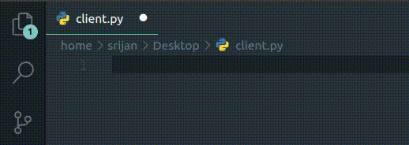

## Hi, I am Srijan full time student and half time developer 👋🏾

## My Status
- 🔭 Web Designing since 2018
- 🌱 Currently wroking on my python skills
- 👯 If you want a collaborate I'am up for it 
- 🧑🏿‍🎓 Student
- ♑ Capricorn(not a developing tool 🤣)

## My Work
-  Point of Sale (POS)  
&nbsp;&nbsp;&nbsp;&nbsp;&nbsp;

## Area Of Interest

### Connect with me:

